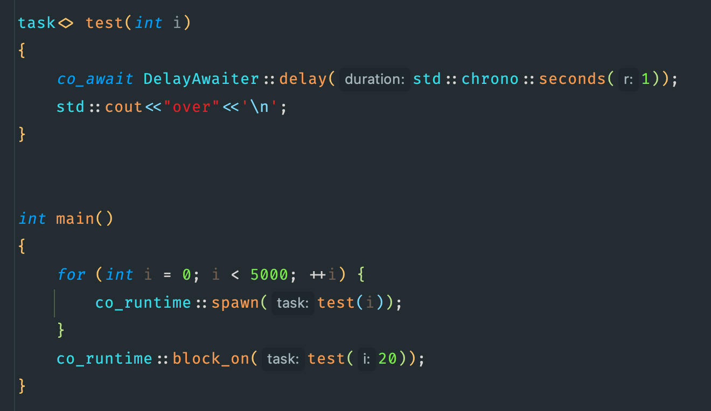

# Coplus 👋
---
>A stackless coroutine library based on c++20, use to implement async network programming and other async I/O operations.

## ✨RoadMap
---
+ ✅ basic ```task<T>``` future type and promise type.
+ ✅ multi-thread scheduler, based on min heap.
+ ✅ async timer and async delay.
+ ✅️ kqueue based I/O multiplexing on MacOS.
+ ☑️ async socket read and write.
+ ☑️ async file read and write.
+ ☑️ use epoll/io uring on linux, iocp on windows.
+ ☑️ async mutex and channel.
+ ☑️ use lock free queue
+ ☑️ joinable coroutine
+ ☑️ run coroutine blockly, based on thread pool.


